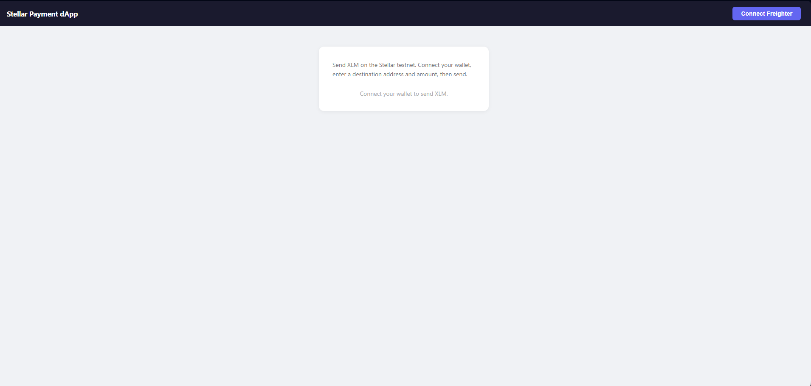
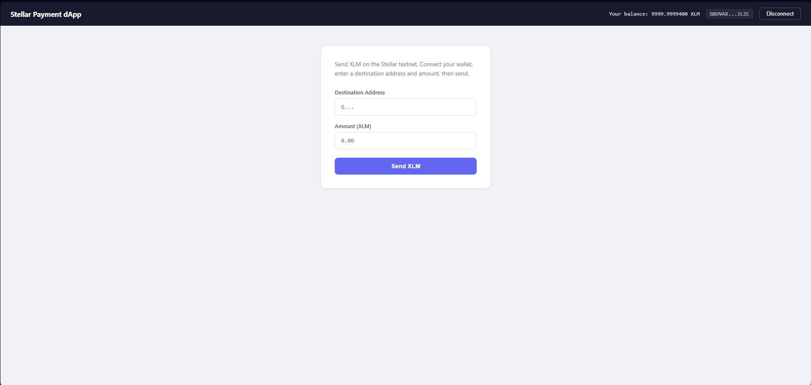
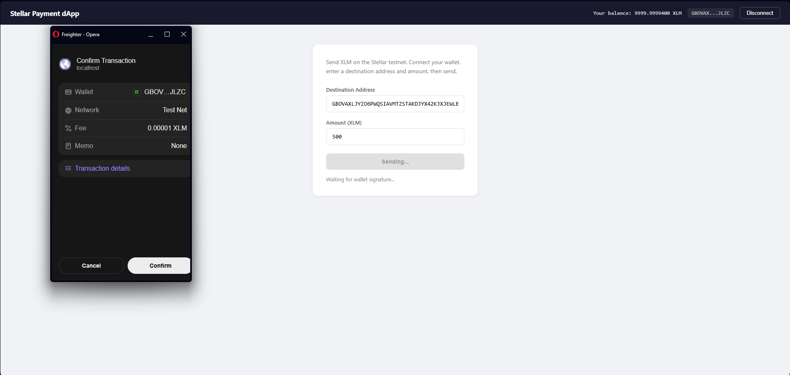
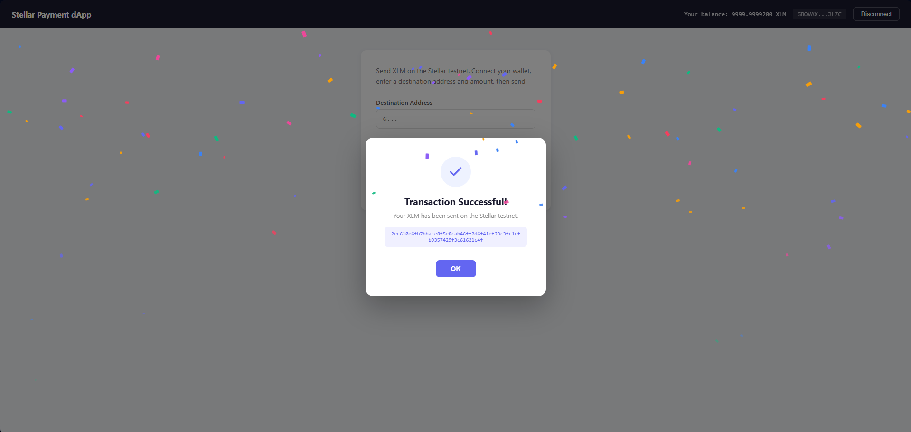

# Stellar Payment dApp

A simple payment application built on the Stellar network testnet. Part of the **Stellar Journey To Mastery - Monthly Builder Challenge (Level 1 - White Belt)**.

## Features

- **Wallet Connection** — Connect and disconnect Freighter wallet
- **Balance Display** — Real-time XLM balance in the header
- **Send XLM** — Send XLM to any Stellar testnet address
- **Transaction Feedback** — Success popup with confetti effect and transaction hash link to Stellar Explorer
- **Error Handling** — Clear error messages for failed or rejected transactions

## Tech Stack

- **Frontend:** React + Vite
- **Styling:** Inline Styles
- **Stellar SDK:** `@stellar/stellar-sdk`
- **Wallet:** `@stellar/freighter-api`

## Setup

1. Clone the repository:
   ```bash
   git clone https://github.com/YOUR_USERNAME/stellar-payment-dapp.git
   ```
2. Install dependencies:
   ```bash
   cd stellar-payment-dapp
   npm install
   ```
3. Start the dev server:
   ```bash
   npm run dev
   ```
4. Open `http://localhost:5173` in your browser.

## Prerequisites

- [Freighter](https://chromewebstore.google.com/detail/freighter/bcacfldlkkdogcmkkibnjlakofdplcbk) browser extension installed
- Freighter set to **Testnet**
- A funded testnet account (get test XLM from [friendbot.stellar.org](https://friendbot.stellar.org))

## Screenshots

### Wallet Disconnected


### Wallet Connected + Balance


### Sending Transaction (Freighter Popup)


### Transaction Successful (Confetti + Hash)

