# Stellar Crowdfund dApp

A decentralized crowdfunding application built on the Stellar testnet using Soroban smart contracts with milestone-based fund release, donor-protected voting escrow, and soulbound Proof-of-Impact NFTs. Part of the **Stellar Journey To Mastery - Monthly Builder Challenge (Level 4 - Green Belt)**.

## Live Demo

[View Live App](https://stellar-payment-dapp-chi.vercel.app)

## Demo Video

[Stellar Crowdfund dApp - Level 4 Demo](https://youtu.be/XsBphLXYVqg)

## Features

### Core Functionality
- **Milestone-Based Crowdfunding** — Campaigns are broken into milestones. Funds are released only when milestones are approved by donors.
- **Factory + Campaign Architecture** — Factory contract deploys individual Campaign contracts, each with its own state, milestone logic, and token handling.
- **Donor-Protected Voting Escrow** — Only donors can vote. Quorum requires majority of donors (min 2) plus 66% supermajority to release funds.
- **On-Chain Feedback** — Users submit star ratings and comments stored on-chain via Soroban events.
- **Soulbound Proof-of-Impact NFTs** — Voters on approved milestones automatically receive non-transferable NFTs as proof of participation.
- **Withdraw System** — Campaign creators can withdraw released funds to their wallet.

### User Experience
- **Multi-Wallet Support** — Connect with Freighter, Albedo, LOBSTR, xBull, Rabet, or Hana Wallet via StellarWalletsKit
- **Create Campaign** — Create on-chain campaigns with custom name, goal, deadline, and milestones
- **Donate XLM** — Donate to any campaign directly from your wallet with quick-select amounts
- **Real-Time Updates** — Auto-polling every 10-15 seconds keeps campaign data fresh without manual refresh
- **Optimistic Updates** — UI updates instantly on submit/approve before RPC confirms
- **User-Friendly Error Handling** — Clear English error messages instead of raw WASM errors
- **Loading States & Skeletons** — Smooth loading indicators and skeleton screens
- **Mobile Responsive** — Fully responsive design for mobile, tablet, and desktop
- **Confetti Animation** — Celebration effect on successful transactions
- **Error Boundary** — Graceful crash recovery with user-friendly fallback UI

### Monitoring & Analytics
- **Vercel Analytics** — Real-time visitor tracking, page views, bounce rate
- **API Health Endpoint** — `/api/health` returns server status and uptime
- **API Metrics Endpoint** — `/api/metrics` returns on-chain donation, feedback, and vote statistics from Soroban RPC
- **CI/CD Pipeline** — GitHub Actions for automated testing, Vercel for auto-deployment

## Smart Contracts

### Factory Contract
- **Address:** `CDXVHHKWEA7VA62KZKMTUCLQC6XR3URCZBA7QGPAFE6PP4AY2NG675TM`
- **Functions:**
  - `initialize(admin, campaign_wasm)` — Set admin and campaign WASM hash
  - `create_campaign(creator, name, goal, deadline, milestones)` — Deploy a new Campaign contract
  - `get_campaigns()` — List all deployed campaign addresses
  - `get_campaign_count()` — Total number of campaigns
  - `set_campaign_wasm(wasm)` — Update campaign WASM hash (admin only)
  - `set_nft_contract(nft_contract)` — Set NFT contract address (admin only)

### Campaign Contract
- **WASM Hash:** `84ecd4aa230319b8e9fc065312dae6cd2085216bb9eb60e715b9e5b990ed0993`
- **Functions:**
  - `init(admin, factory, name, goal, deadline, milestones)` — Initialize campaign with milestones and token address
  - `donate(donor, amount)` — Donate XLM (transfers from donor to contract)
  - `submit_milestone(admin, index)` — Mark milestone as submitted for voting
  - `vote_approve(donor, index)` — Approve a milestone (donor only, once per milestone)
  - `vote_reject(donor, index)` — Reject a milestone (donor only, once per milestone)
  - `release_milestone(index)` — Release funds when quorum + supermajority met
  - `withdraw(to, amount)` — Withdraw released funds (admin only)
  - `claim_refund(donor, index)` — Claim refund if milestone rejected
  - `submit_feedback(user, rating, comment)` — Submit on-chain feedback
  - `get_name()` / `get_goal()` / `get_info()` / `get_admin()` — Campaign metadata
  - `get_milestones()` — All milestones with status
  - `get_total_raised()` / `get_total_released()` / `get_total_withdrawn()` — Financial tracking
  - `get_total_donor_count()` / `get_voted_donor_count(index)` — Quorum tracking
  - `get_vote_status(index)` — Approval/rejection counts
  - `get_feedback()` / `get_feedback_count()` — On-chain feedback

### Reward NFT Contract
- **Address:** `CBTSMA4A4GUFMXLGYVXXMYFXGP6V65NS7GHENDTN2TWT6YWRVRKBNFBA`
- **Functions:**
  - `init(admin)` — Initialize NFT contract
  - `mint(to, token_id, campaign, milestone, amount)` — Mint soulbound NFT (admin only)
  - `balance_of(owner)` / `get_approved(token_id)` / `is_approved_for_all(owner, operator)` — Standard NFT queries
  - `transfer_from(from, to, token_id)` — Blocked (soulbound, non-transferable)

## Tech Stack

- **Frontend:** React 19 + Vite 8
- **Styling:** Tailwind CSS v4
- **State Management:** Zustand
- **Stellar SDK:** `@stellar/stellar-sdk` v16
- **Wallet Kit:** `@creit.tech/stellar-wallets-kit` v2.4.0
- **Smart Contracts:** Soroban (Rust, soroban-sdk v26)
- **Testing:** Vitest + React Testing Library (frontend), Cargo test (26 contract tests)
- **Analytics:** Vercel Analytics
- **CI/CD:** GitHub Actions + Vercel
- **Linting:** OxLint

## Project Structure

```
stellar-payment-dapp/
├── contract/
│   ├── Cargo.toml
│   └── contracts/
│       ├── campaign/
│       │   ├── Cargo.toml
│       │   └── src/lib.rs              # Campaign contract + 26 tests
│       ├── factory/
│       │   ├── Cargo.toml
│       │   └── src/lib.rs              # Factory contract + tests
│       └── reward_nft/
│           ├── Cargo.toml
│           └── src/lib.rs              # Soulbound NFT contract
├── src/
│   ├── App.jsx                         # Main app with full contract integration
│   ├── store.js                        # Zustand state management
│   ├── config.js                       # Contract addresses & network config
│   ├── feedback.js                     # On-chain feedback submission
│   ├── main.jsx                        # Entry point with Analytics + ErrorBoundary
│   ├── components/
│   │   ├── Header.jsx                  # Wallet connect/disconnect/balance
│   │   ├── CampaignCard.jsx            # Campaign list & detail views
│   │   ├── CreateCampaign.jsx          # Campaign creation form
│   │   ├── DonateForm.jsx              # Donation form with quick amounts
│   │   ├── RecentDonations.jsx         # On-chain donation history
│   │   ├── RecentFeedback.jsx          # On-chain feedback display
│   │   ├── FeedbackForm.jsx            # Star rating + comment form
│   │   ├── NftModal.jsx                # Proof-of-Impact NFT viewer
│   │   └── ErrorBoundary.jsx           # Graceful crash recovery
│   └── __tests__/
│       ├── Header.test.jsx
│       ├── CampaignCard.test.jsx
│       ├── DonateForm.test.jsx
│       ├── FeedbackForm.test.jsx
│       └── NftModal.test.jsx
├── api/
│   ├── health.js                       # Health check endpoint
│   └── metrics.js                      # On-chain metrics endpoint
├── scripts/
│   └── demo.cjs                        # Automated 10-user simulation
├── screenshots/level4/                 # Level 4 submission screenshots
├── docs/
│   └── USER_FEEDBACK.md                # User feedback summary
├── .github/workflows/ci.yml           # CI/CD pipeline
└── package.json
```

## API Endpoints

### Health Check
```
GET /api/health
```
Returns server status, timestamp, uptime, and environment.

### Metrics
```
GET /api/metrics
```
Returns on-chain statistics from Soroban RPC: total donations, feedback, votes, unique donors, and response time.

## Setup

1. Clone the repository:
   ```bash
   git clone https://github.com/EnesPacaci/stellar-payment-dapp.git
   ```
2. Install dependencies:
   ```bash
   cd stellar-payment-dapp
   npm install --legacy-peer-deps
   ```
3. Start the dev server:
   ```bash
   npm run dev
   ```
4. Open `http://localhost:5173` in your browser.

## Prerequisites

- A Stellar wallet extension installed (Freighter recommended)
- Wallet set to **Testnet**
- A funded testnet account (get test XLM from [friendbot.stellar.org](https://friendbot.stellar.org))

## Testing

```bash
# Frontend tests
npx vitest run

# Smart contract tests (requires Rust toolchain)
cd contract
cargo test
```

## CI/CD Pipeline

- **CI:** GitHub Actions runs lint, build, and tests on every push to `main`
- **CD:** Vercel auto-deploys on every successful push to `main`

## Screenshots

### Product UI - Campaign List
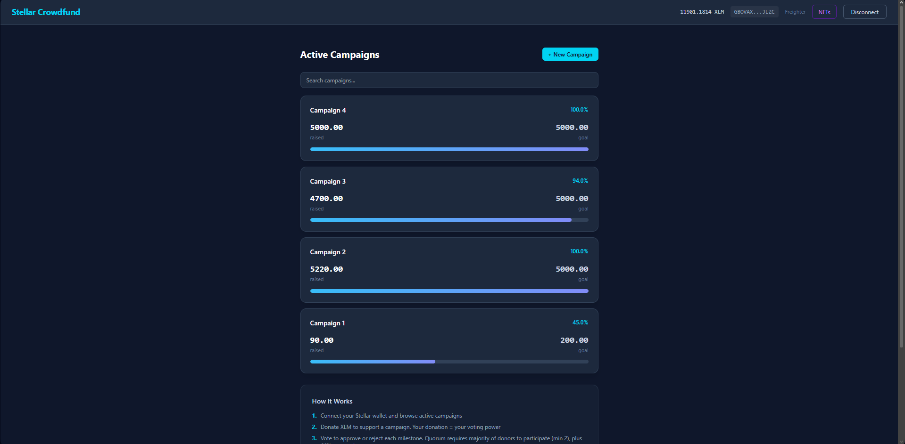

### Campaign Detail with Milestones & Voting
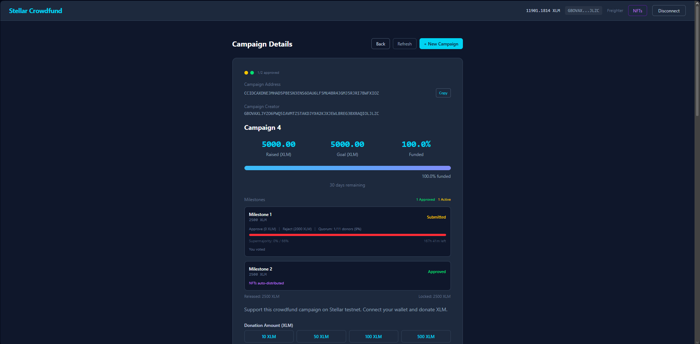

### Recent Donations & User Feedback
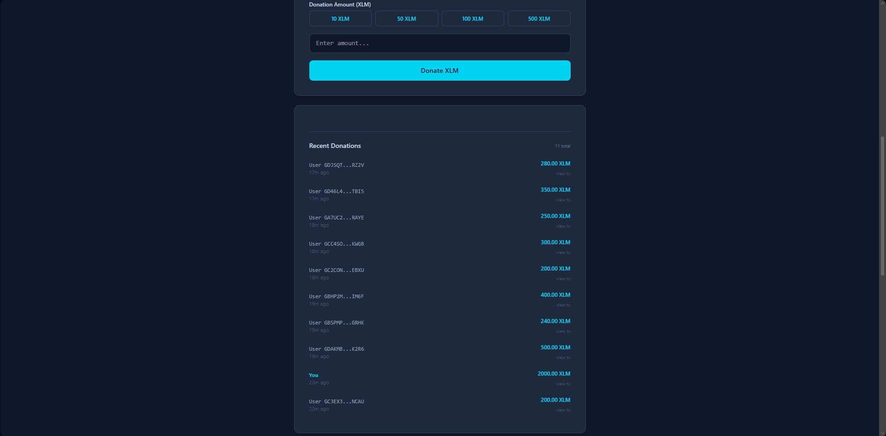

### Mobile Responsive Design
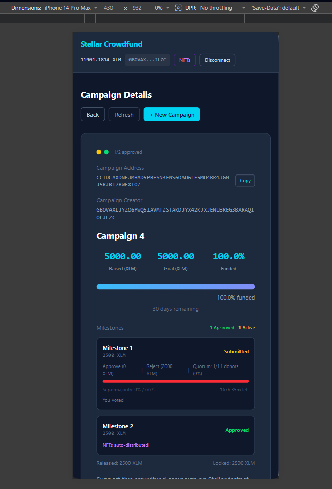

### Create Campaign Form
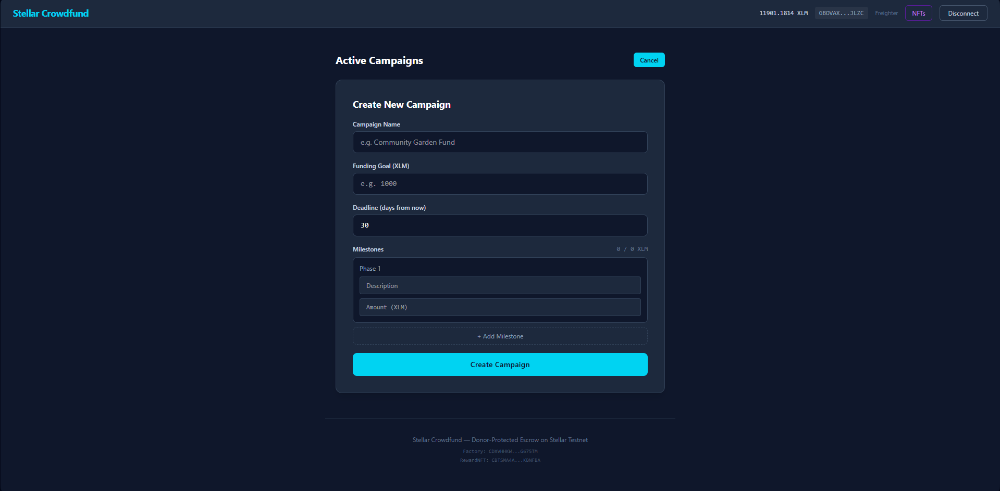

### Proof-of-Impact NFTs
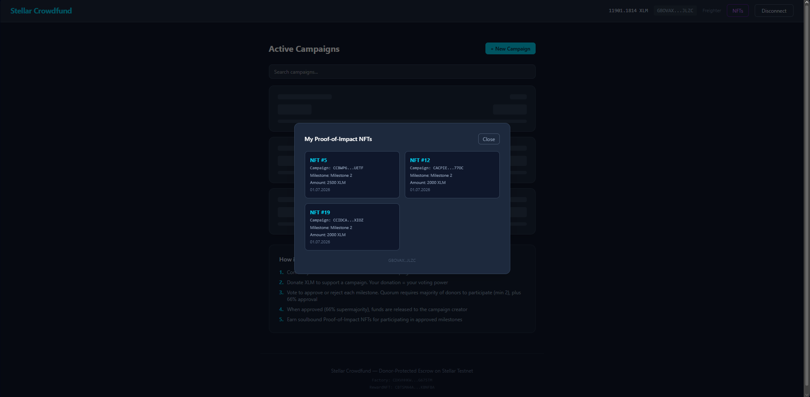

### CI/CD Pipeline - GitHub Actions
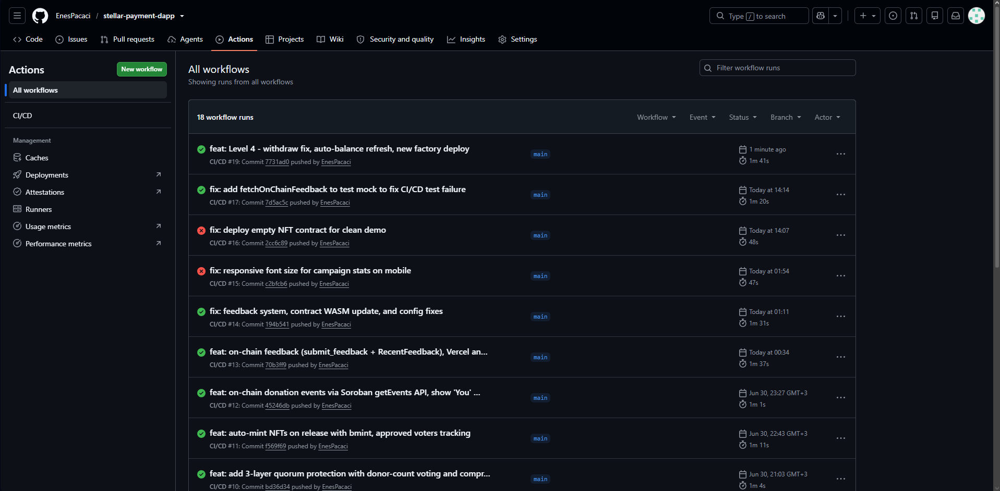

### Production Deployment - Vercel
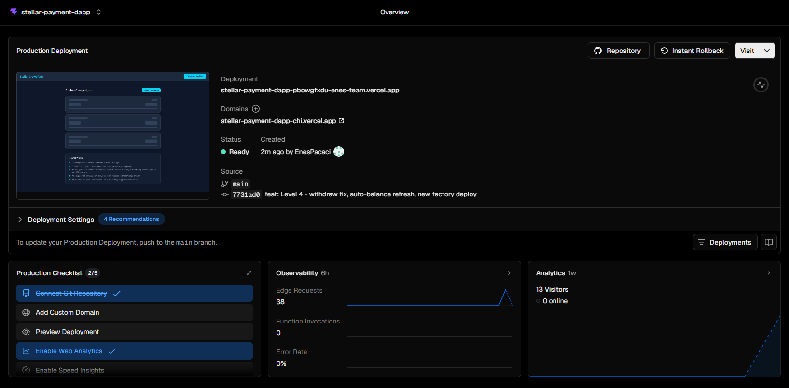

### Monitoring & Analytics - Vercel Dashboard
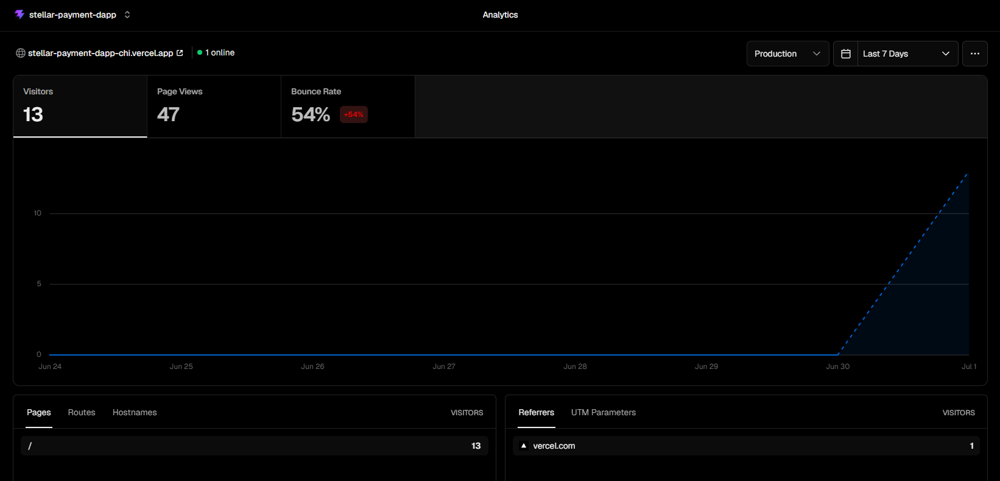

### Proof of 10+ User Wallet Interactions
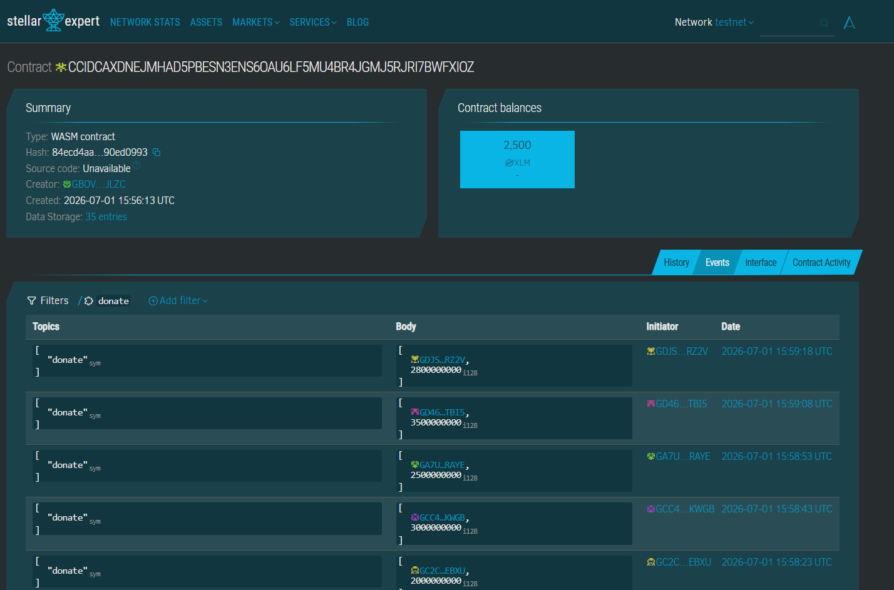
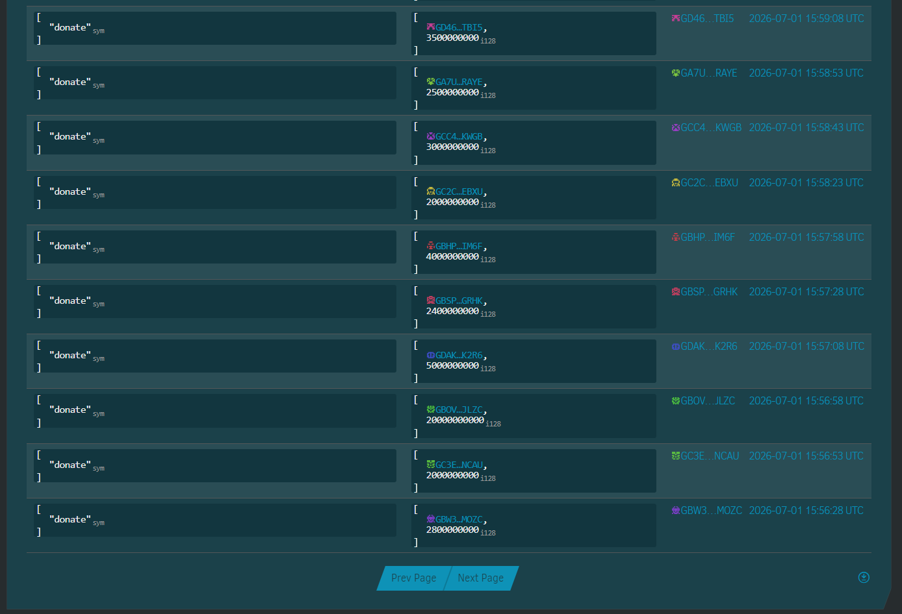

## User Feedback Summary

See [docs/USER_FEEDBACK.md](docs/USER_FEEDBACK.md) for detailed feedback from 10 testnet users.

**Average Rating: 4.6/5 stars** | 8 feedback submissions on-chain

## License

MIT
