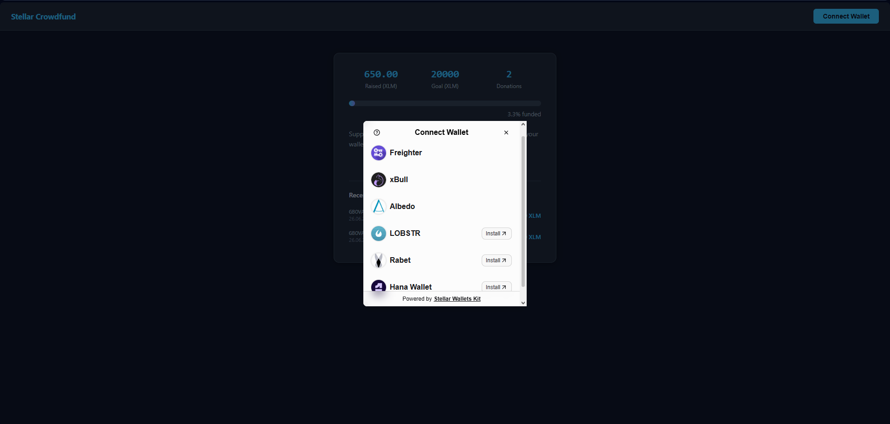
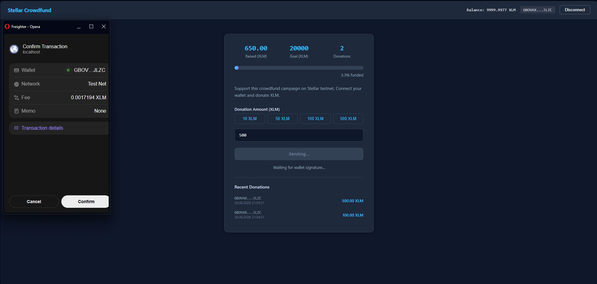
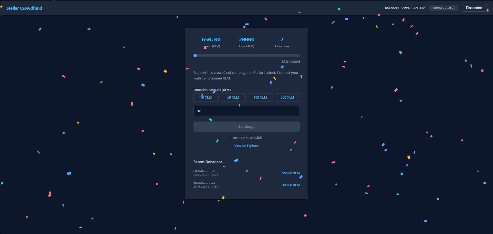

# Stellar Crowdfund dApp

A decentralized crowdfunding application built on the Stellar testnet using a Soroban smart contract. Part of the **Stellar Journey To Mastery - Monthly Builder Challenge (Level 2 - Yellow Belt)**.

## Live Demo

[View Live App](https://stellar-payment-dapp.vercel.app)

## Features

- **Multi-Wallet Support** — Connect with Freighter, Albedo, LOBSTR, xBull, Rabet, or Hana Wallet via StellarWalletsKit
- **Smart Contract** — Soroban contract deployed on testnet for on-chain donation tracking
- **Donate XLM** — Donate to the crowdfund campaign directly from your wallet
- **Real-Time Progress** — Live raised amount, goal, and progress bar synced from contract state
- **Recent Donations** — Track latest donations with address, amount, and timestamp
- **Confetti Animation** — Celebration effect on successful donation
- **Transaction Status** — Visible status updates (Building → Signing → Submitting → Success)
- **Error Handling** — 3 error types: wallet rejected, insufficient balance, account not found

## Smart Contract

- **Contract Address:** `CDVCR252R3SL4DDLTAX6XZ4G7K2EZAN5EURMNFYUNVM6A7ABVP5HRTLD`
- **Deploy TX:** [View on Explorer](https://stellar.expert/explorer/testnet/tx/6fa23c30cba7cfd105f89a924a05dea22b1d2a8bfe7a41d315cb62455b16d51)
- **Functions:**
  - `initialize(admin, goal)` — Set admin and funding goal
  - `donate(donor, amount)` — Donate XLM to the campaign
  - `get_total_raised()` — Read total donations
  - `get_goal()` — Read funding goal

### Example Contract Call

Donation TX (verifiable on Stellar Explorer):
`7d183d086c3f4747f2bf2491b6fa01cccab45395e482c88c29e3c67130467925`
→ [View on Stellar Explorer](https://stellar.expert/explorer/testnet/tx/7d183d086c3f4747f2bf2491b6fa01cccab45395e482c88c29e3c67130467925)

## Tech Stack

- **Frontend:** React + Vite
- **Styling:** Inline Styles (dark theme)
- **Stellar SDK:** `@stellar/stellar-sdk` v16
- **Wallet Kit:** `@creit.tech/stellar-wallets-kit` v2.4.0
- **Smart Contract:** Soroban (Rust)

## Setup

1. Clone the repository:
   ```bash
   git clone https://github.com/EnesPacaci/stellar-payment-dapp.git
   ```
2. Install dependencies:
   ```bash
   cd stellar-payment-dapp
   npm install
   ```
3. Start the dev server:
   ```bash
   npm run dev
   ```
4. Open `http://localhost:5173` in your browser.

## Prerequisites

- A Stellar wallet extension installed (Freighter recommended)
- Wallet set to **Testnet**
- A funded testnet account (get test XLM from [friendbot.stellar.org](https://friendbot.stellar.org))

## Screenshots

### Wallet Options Modal


### Donate Sending (Freighter Confirmation)


### Donate Success (Confetti + Explorer Link)

